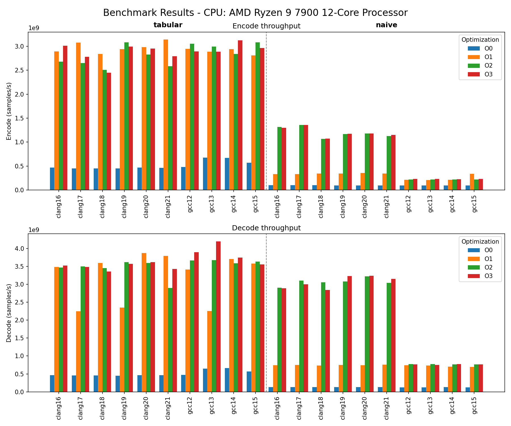

# ⚡ ALawBench – A‑law Algorithm Benchmark

**ALawBench** is a tool for comparing the performance of different A‑law companding implementations.  
It automates building and running benchmarks in isolated Docker containers, iterating over compilers (GCC, Clang), optimization levels (`O0`...`O3`), and algorithm variants.

Results are produced as structured JSON, can be exported for further analysis, and optionally visualised with a built‑in plot generator.

---

## ✨ Features

- 🐳 **Full isolation** – every combination is built and run in a clean Docker container, guaranteeing reproducibility.
- 🔄 **Multi‑compiler support** – GCC 12...15, Clang 16...21 (easily extendable).
- ⚙️ **All optimisation levels** – `O0`, `O1`, `O2`, `O3`.
- 📦 **Two reference implementations**:
  - `naive` – computes A‑law on the fly (arithmetic + conditionals).
  - `tabular` – uses precomputed lookup tables for encoding/decoding.
- 🧩 **Easy to add new algorithms** – just drop a new subfolder with `encoder.h/cpp`, `decoder.h/cpp` (and optionally `common.h`).
- 📊 **Built‑in visualisation** – generates a comparative bar chart for encode/decode throughput.
- 📝 **Flexible output** – JSON results, export to file, console summary table.
- 🔍 **Debug mode** – `-v` shows full build and run logs.

---

## 🧰 Requirements

- **Docker** – for isolated builds.
- **Python 3.8+** – to run the `alawbench.py` orchestrator.
- **Optional (for plotting):** `pandas` and `matplotlib`  

Install them with:
```bash
pip install pandas matplotlib
```

🚀 Quick Start

1. Clone the repository:
```bash
git clone https://github.com/yourname/a-law-bench.git
cd a-law-bench
```

2. Run the benchmark:
```bash
python3 runner.py
```
By default, all combinations of compilers, versions, optimisations, and the two algorithms will be executed.

3. After completion, a Markdown summary is printed. Optionally export results to JSON or generate a plot:
```bash
python3 runner.py --plot --export results.json
```

📊 Example Plot

When you run with --plot, a file benchmark_plot.png is created, showing encode and decode throughput side by side, grouped by algorithm and optimisation level.



(The plot above is an example from a previous run.)

## ➕ Adding a New Algorithm

1. Create a subdirectory under src/algorithms/, e.g., myalgo.
2. Implement the required classes with the following methods:
  - ALawEncoder::Encode(const uint16_t* in, uint8_t* out, size_t size)
  - ALawDecoder::Decode(const uint8_t* in, uint16_t* out, size_t size)
3. Ensure the directory contains encoder.h, encoder.cpp, decoder.h, decoder.cpp (and optionally common.h).
4. Run the script with your new algorithm:
```bash
python3 runner.py --algorithms myalgo
```
(or add it to DEFAULT_ALGORITHMS inside the script).

No changes to the benchmark code are needed – it automatically includes the headers using the path passed via CMake.

## 🧪 Command‑Line Arguments

| Argument                                | Description                                        |
|-----------------------------------------|----------------------------------------------------|
| --compilers {gcc,clang} [gcc clang ...] | Compilers to test (default: both)                  |
| --gcc-versions VERSIONS                 | GCC versions (default: 12 13 14 15)                |
| --clang-versions VERSIONS               | Clang versions (default: 16 17 18 19 20 21)        |
| --opt-levels LEVELS                     | Optimisation levels (default: O0 O1 O2 O3)         |
| --algorithms NAMES                      | Algorithm names (subfolders under src/algorithms/) |
| -v, --verbose                           | Verbose output (show build/run logs)               |
| --plot                                  | Generate a plot (benchmark_plot.png)               |
| --export FILE                           | Export all results to a JSON file                  |

Example: run only GCC 13 and Clang 18, optimisations O2 and O3, only the naive algorithm, plot results, and save JSON:
```bash
python3 alawbench.py --compilers gcc clang --gcc-versions 13 --clang-versions 18 --opt-levels O2 O3 --algorithms naive --plot --export results.json
```

## 📄 License

This project is licensed under the MIT License – see the LICENSE file for details.

## 🤝 Contributing

Contributions are welcome! Feel free to open issues or pull requests for new algorithms, additional compilers, or improvements to the benchmarking framework.